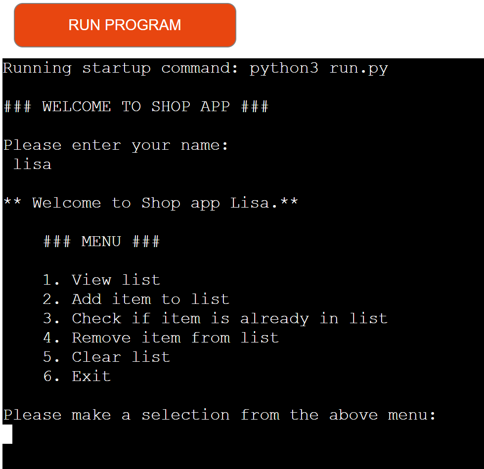
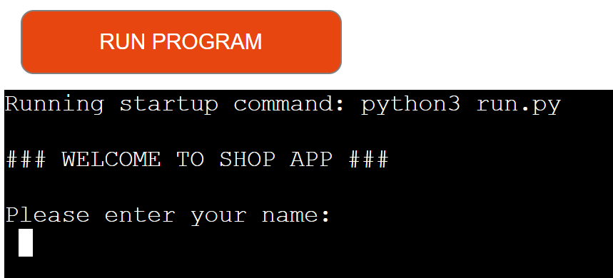
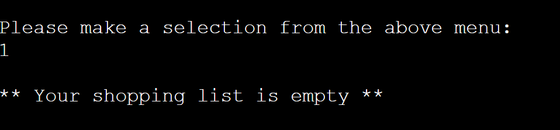
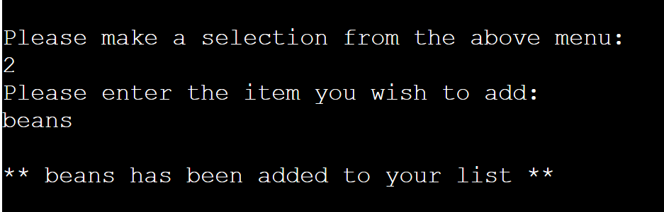
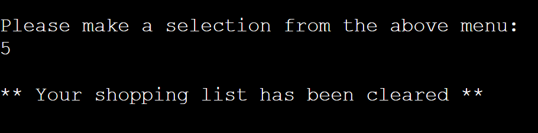
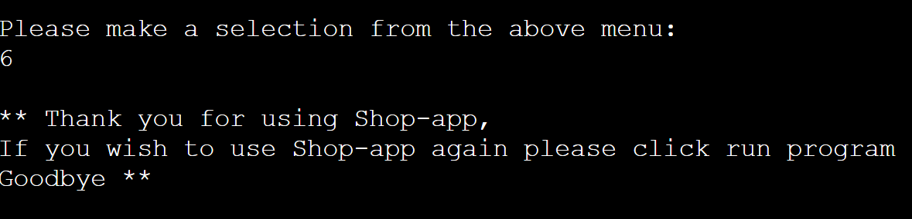
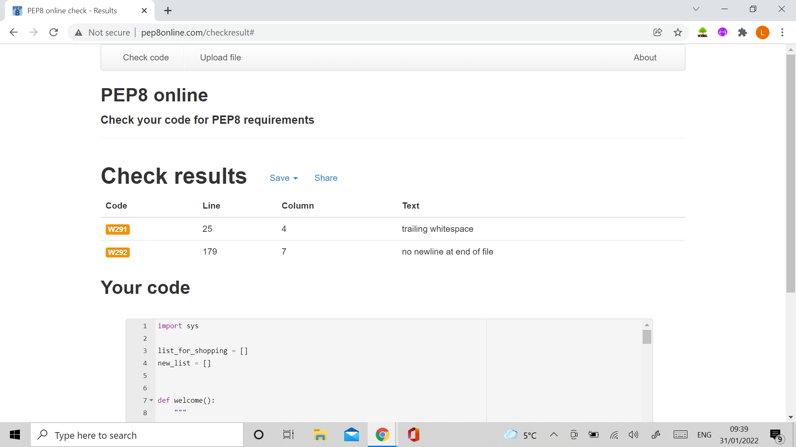

# SHOP APP

[View the live site here](https://python-shop-app.herokuapp.com/)

[View the github repository here](https://github.com/Mrst12/shop-app)

## Final Design

## Introduction

This application is built using python, during the first covid lockdown,
we couldn't go to the shops because of our disabled children, so we used to get 
a delivery from a supermarket, there were times because of panic buying,
that we could not get the items we requested, so my husband kept ordering them,
when it came to putting the shopping away, there was no space for the items, as
he did not check the cupboards before ordering. I thought this would be a handy application
for him to save overstocking the cupboards.

## Contents
- [User Experience](#user-experience-ux)
    - [User Stories](#user-stories)
- [flowchart](#flowchart)
- [Features](#features)
- [Technologies Used](#technologies-used)
    - [Languages](#languages)
    - [Programmes Used](#programmes-used)
- [Testing](#testing)
    - [Testing User Stories](#testing-user-stories)
    - [Validation](#validation)
    - [Known Bugs](#known-bugs)
- [Deployment](#deployment)
- [Credits](#credits)
    - [Acknowledgements](#acknowledgements)

## User Experience (UX)

- ### User Stories

    1. As a user, I want clear instructions on how to use the app.
    2. As a user, I want feedback as I progress throught the app.
    3. As a user, if i get something wrong, I would like to know what that is.
    4. As a user, I want the app to be easy to use.

## Flowchart

[Flowchart for the logic of the app](./assets/images/shopapp.png)

## Features

- The application includes a welcome message after asking for the users name(shown in the final product above)

- It then shows the user the menu in which they can enter a choice. The menu is shown for every selection.
- When the user views the shopping list and it is empty, it will give them a feedback message,
if the shopping list has items on it will list the items.

- The user if they choose to add an item will be asked what they would like to add,
if the item already in the list they will be told, if it's not in the list it will be added.

- The check and remove item functions are similar to the add item, so the user has consistency.
- There is a clear list function so the user can clear the whole list in one go

- There is an exit function with a feedback message so the user can exit on each selection.

## Technologies Used
### Languages

- Python
### Programmes used
- Lucid app
    - For the flowchart
- Git
    - For version control, commiting and pushing to Github.
- Github
    - For storing the repository, files and images pushed from Gitpod.
- Gitpod
    - IDE used to code the application.
- Heroku
    - Used to deploy the application.
- Pep8 online python checker
    - used for checking validation of my code.
## Testing

- I used pep8 online python checker to test my code, I had a few lines of code which were too long for the
editor so had to rearrange them so they were in the 80 characters range.

### Testing user stories

1. As a user, I want clear instructions on how to use the app.
    - There are instructions every step of the way for users.
2. As a user, I want feedback as I progress throught the app.
    - Everytime a user does something on the application it tells them what they have done
    For example added bread to their shopping list, or cleared their list.
3. As a user, if i get something wrong, I would like to know what that is.
    - When something is inputted wrong there is feedback to tell the user what they did wrong,
    and how to put it right.
4. As a user, I want the app to be easy to use.
    - The app is well laid out with clear gaps between lines to show the user whta has happenedwith their choice
    I also added an extra message on the end of the app after exiting, so the user wasnt left wondering wether
    they had been successful. A clear goodbye message was shown instead.

### Validation

- The application was checked for numbers, uppercase, lowercase and a mixture from user input,
    - A check was put in so only words could be entered and then an input asked for again, when the user
    input their name regardless of wether it was upper or lowercase, it Capitalised the first letter.
    Regardless of how they input their item (upper/lower), the app made the item lowercase for checking items 
    purposes.
- The application was checked for blank spaces and a user just pressing enter, a message is printed
asking them for a valid input.

### Known bugs
- I have a trailing whitespace on line 25 which is a print statement that i cannot seem to get rid of
- I do not have a blank line at the end of the document as even when it puts it in it doesn't seem to show.

## Deployment
- This application has been deployed using Heroku
1. Create or sign into a Heroku account
2. Click the Create new app button
3. Choose a name for the app (This needs to be unique)
4. Choose region, then click create app.
5. Click on settings
6. Click reveal config vars button
    - In this project we needed to add a key of PORT and VALUE of 8000
7. Click add.
8. Click add buildpack
    - Here we add python, save changes
    - node.js, save changes
    - make sure python is on top.
9. Go to the deploy tab
10. Choose your deployment method (ours is github)
11. Search for our repository name, then connect
12. You can choose to have automatic deploy on 
    - You then click on the manual deploy and wait until you see a finished message saying view app
    - Click the view app button
    - Click the run program button at the top.
## Credits
- I watched a you tube video for inspiration which i then turned into my own code.

[You tube clip continued in 3 parts](https://www.youtube.com/watch?v=0m7csmqWAgI)

[clip2](https://www.youtube.com/watch?v=yixPipmd1GE)

[clip3](https://www.youtube.com/watch?v=8Jcls2gIqSs)

### Acknowledgements
- Code institute for course material and content
- Everybody on the slack community for support, guidance and patience especially John McPherson
who helped me understand why my final piece of code refused to work, and Dave Horrocks who
helped me to finish the deployment of my app.
- My mentor for assistance and advise on planning and final submission feedback.
- My husband and children for their patience, support and understanding.
